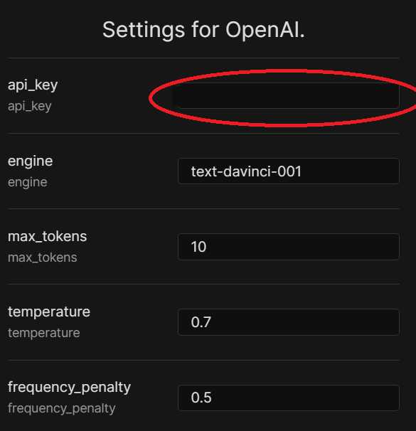

# Obsidian Text Generator Plugin 
<a href="https://www.buymeacoffee.com/haouarine" target="_blank"></a>

# [Documentation of Version 0.1.X](https://bit.ly/3ORwT00)

# Version 0.0.X 
The **Obsidian Text Generator plugin** is a handy tool that can help you generate text content using the powerful language model GPT-3 directly. This makes the plugin more affordable and powerful than other avaible AI text assistants and can help you get the most out of your Obsidian experience. For further details, you might check the following article [Obsidian + Text Generator Plugin: More Affordable and Powerful AI Text Assistant Helper](https://medium.com/@haouarin/obsidian-text-generator-plugin-more-affordable-and-powerful-ai-text-assistant-helper-8f84ee84fd42). 

If you're looking for a place to discuss the use cases of this plugin and share your experiences, head over to the [Discussion](https://github.com/nhaouari/obsidian-textgenerator-plugin/discussions/categories/use-cases). There, you'll find a community of like-minded users who are eager to help you make the most of this powerful tool.

<a href="https://www.youtube.com/watch?v=Z9Z25lBL1Kw" target="_blank">
<p align="center">
  
</p>
</a>

> To use Text generator you need to: 
> * 01 Get an API Key (create an account at OpenAI) 
> * 02 Configure the plugin's setting to use API Key. 

 

# 01 Create an account at OpenAI

To generate Open AI API Key.  Follow  the following steps: 

  

1. Create an account on [OpenAI](https://beta.openai.com/signup) (you will get a free 18$ trial account). 

2. Click on your Account and click on View API keys

<p align="center">
  
</p>


3. Generate the API key that Text Generator Plugin will use

<p align="center">
  
</p>
  

# 02 Configure Text Generator plugin

After installing the "Text generator plugin" and enabling it, you need to provide the generated API Key to the plugin. 

<p align="center">
  
</p>

  

To use the Text Generator Plugin efficiently, you need to understand three main steps: Considered Context, how to control the size of the generated text, and how the generation commands work.

## 1. Considered Content

The context that is considered by the Text Generator Plugin can be either the selected text, or the line where the cursor is. If the line is empty, the plugin will generate text based on the whole content.

## 2. Generated Text Size

You can easily control the size of the generated text: "Increase max_tokens by 10" and "decrease max_tokens by 10." The actual max_tokens appears in the status bar **'Text generator (max_tokens):"** .


## 3. Generation commands

There are two generation commands available: "Generate Text!" and "Generate Text (use Metadata)."

### "Generate Text!"
"Generate Text!" will generate a text with a max size of (**max_tokens**) using GPT-3 and insert it on the current cursor position based on **Considered Context**.  You will see in the status bar **"Text generator (max_tokens): processing..."** while generating the text. 

### "Generate Text (use Metadata)"
 You can append the front matter or the metadata information of the document [^0] by using "Generate Text (use Metadata)" which might ensure higher effeciency [^1].   

let's take as an example the following document.

> 🔴 Past the code with (CTRL + SHIFT + V) or (⌘+ SHIFT + V for MAC users) to avoid formating issues.

```
---
title: "Obsidian + Text Generator Plugin: The More Affordable and Powerful AI Text Assistant Helper"
keywords: AI Text Assistant Helper, text assistant helper, Jasper
--- 
Write conclusion
```


By running "Write conclusion " with **Generate Text (use Metadata)**, Text Generator Plugin will append the metadata information and send the command like this.

```
title: "Obsidian + Text Generator Plugin: The More Affordable and Powerful AI Text Assistant Helper" 
keywords: AI Text Assistant Helper, text assistant helper, Jasper 
Write conclusion  
```


> It is more practical to use hotkeys for the different commands[^2].


# Interact with GPT-3 

There are several paid text editors based on GPT3.  You can, for example, search on YouTube about videos about on these editors and use the same prompts directly on GPT3 using Text Generator Plugin. 

One of the most famous paid tools in the market is [Jasper](https://jasper.ai?special=qHt_szZ).  In Jasper, there are pre-built workflows known as [Recipes](./recipes.md) that contain a series of Jasper (text editor based on GPT-3) prompts to help you create content with Jasper using a repeatable process. You can use the same commands to generate the content that you want!

[^1]: This command is useful if you want to use OpenAI more efficiently. Selecting the hole text every time will perhaps give better results, but the cost will be higher since OpenAI considers both input and output tokens. The idea here is to use a small meaningful context and append it with the running command to keep the generating text meaningful and cost-efficient. Open AI API considers both input and output tokens in their cost calculation [Open AI pricing] (https://openai.com/api/pricing/)].
[^2]: To set a hotkey for a command, go to the "Settings" menu and select the "Hotkeys" tab. You will see a list of all the available commands, along with the associated hotkey. Click on the desired command and press the key combination you would like to use. Make sure that another application does not already use the key combination.
[^0]: [YAML+front+matter in Obsidian](https://help.obsidian.md/Advanced+topics/YAML+front+matter)

